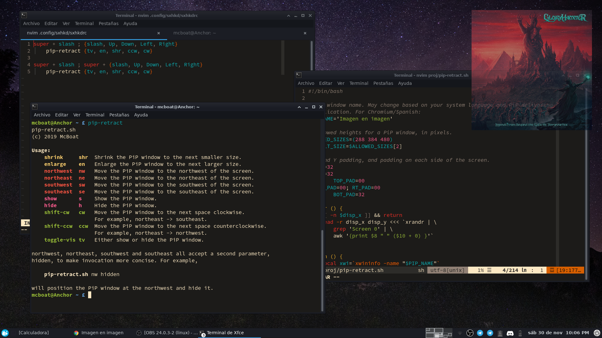

# pip-retract

Move a picture-in-picture window on an X display about your screen via
absolute and relative terms, and show and hide it.

## Usage

First, clone the repo and install `pip-retract.sh` wherever you prefer. Ensure
you have all the necessary dependencies, as well as `bash` and the "givens"
for shell scripting:

* `xwininfo`
* `xdotool`
* `xrandr`

`pip-retract`'s usage info may be displayed by invoking it with no arguments,
but for reference, it is printed below.

```
pip-retract.sh
(c) 2019 McBoat

Usage:
    shrink     shr  Shrink the PiP window to the next smaller size.
    enlarge    en   Enlarge the PiP window to the next larger size.
    northwest  nw   Move the PiP window to the northwest of the screen.
    northeast  ne   Move the PiP window to the northeast of the screen.
    southwest  sw   Move the PiP window to the southwest of the screen.
    southeast  se   Move the PiP window to the southeast of the screen.
    show       s    Show the PiP window.
    hide       h    Hide the PiP window.
    shift-cw   cw   Move the PiP window to the next space clockwise.
                    For example, northeast -> southeast.
    shift-ccw  ccw  Move the PiP window to the next space counterclockwise.
                    For example, northeast -> northwest.
    toggle-vis tv   Either show or hide the PiP window.

northwest, northeast, southwest and southeast all accept a second parameter,
hidden, to make invocation more concise. For example,

    pip-retract.sh nw hidden

will position the PiP window at the northwest and hide it.
```

As a note about latency, expect a fair delay when using this program, since
some of the X window manipulation functions are quite slow.

## Configuration

Configuration is done Suckless-style; the following variables lead the program
and their descriptions are in comments preceding each.

* `PIP_NAME`
* `ALLOWED_SIZES`
* `DEFAULT_SIZE`
* `X_PAD`
* `Y_PAD`
* `TOP_PAD`
* `LT_PAD`
* `RT_PAD`
* `BOT_PAD`

## Screenshot

We all love a good screenshot, don't we?


